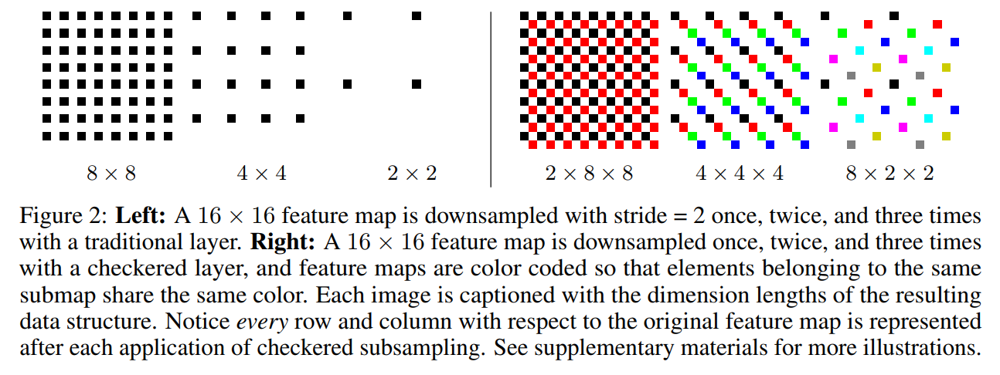

Checkered CNN with Multisampling Visualizations
=======================================================

**Reference**

**Paper**: [[1805.10766] Improving the Resolution of CNN Feature Maps Efficiently with Multisampling](https://arxiv.org/abs/1805.10766)  

The report submitted contains the details.

This repository contains:
- Training and visualizations for the weights and Representation Similarity Matrices (**RSM**) in the notebook **RunScripts.ipynb** (scroll down to the end).
- Implementations of checkered layers and a conversion script for converting traditional CNNs into checkered CNNs (CCNNs) in **checkered_layers.py**. 
- A script for visualizing the patterns created by checkered subsampling in **visualizer.py**. 
- Scripts for training Reference toy CCNN on MNIST (**demo_mnist_ref.py**)
- Scripts for training toy CCNN on MNIST (**demo_mnist.py**) and modern models on CIFAR (**demo_cifar.py**).
- The implementations of DenseNet, ResNet, and VGG that were taken from official implementations under **models/**.



Checkered subsampling improves the accuracy of every architecture as tested on CIFAR10/CIFAR100 (VGG, DenseNet, Wide-ResNet, ResNet). The toy CCNN model trained on MNIST with augmentations achieves accuracy competitive with capsule networks (8.2 million parameters) and beyond the baseline CNN used in the CapsNet paper (35.4 million parameters) with just 93,833 parameters. The results are shown in the figures below.


## Requirements
- Python 3
- Pytorch 0.4
- Numpy
- Fire ('pip install fire' or 'conda install fire -c conda-forge')
- Pillow ('pip install pillow' or 'conda install pillow')

## How to run
After you have cloned the repository, you can either visualize using the ipython notebook train networks on MNIST and CIFAR.

Ipython Notebook visualizations (might have to create a directory **../data** before). Then RUN all the cells.
```bash
!pyhton3 demo_mnist.py --data_path ../data/mnist
```

To visualize a 64x64 image after 3 subsampling steps using the regularly spaced lattice method (output images can be found in the visualize_output/ folder):
```bash
python visualize.py --im_size 64 --steps 3 --method lattice
```
To train tiny CCNN on MNIST (replace data_path with your own path to MNIST, will automatically be downloaded if you don't have it):
```bash
python demo_mnist.py --data_path ../data/mnist
```
To train ResNet50 as a CNN on CIFAR100 (replace data_path with your own path to CIFAR, will automatically be downloaded if you don't have it):
```bash
python demo_cifar.py --data_path ../data/cifar
```


Forward Passes in CNN look like this:

```python
def forward(self, x):
    x = x.unsqueeze(2)
    x = self.layer1(x)
    x = self.layer2(x)
    x = self.layer3(x)
    x = self.layer4(x)
    x = torch.mean(x, 2)
    x = F.avg_pool2d(x, 7).view(x.size(0), -1)
    x = self.fc(x)
    return x
```


## Currently supported Layers
Our conversion script converts the following 2D layers to checkered or 3D layers:
- Conv2d -> CheckeredConv2d
- BatchNorm2d -> BatchNorm3d
- Dropout2d -> Dropout3d
- AdaptiveMaxPool2d -> AdaptiveMaxPool3d
- AdaptiveAvgPool2d -> AdaptiveAvgPool3d
- MaxPool2d -> MaxPool3d
- AvgPool2d -> AvgPool3d


